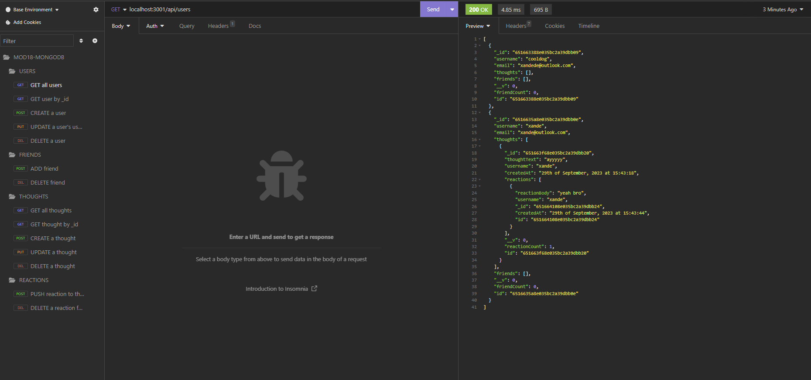

# mongooseY



## Description
MongoDB? or MySQL? I don't know, I just want a database to stash everyone's data and sell it to our data overlords.  That's why I made mongooseY, inspired by X... but Y... and Mongofied.

## Table of Contents

1. [Developer Comments](#developer-comments)
2. [Walkthrough Video](#walkthrough-video)
3. [Usage](#usage)
4. [License](#license)
5. [Contribution](#contribution)
6. [Questions](#questions)

## Developer Comments
This challenge was module 18 of the edX/Monash University bootcamp, focusing on NoSQL databases.  I learned a lot of new things from this unit; not even related to MongoDB, but I like the idea of having all the routes separate to the controllers.  It looks a lot more organised and separates their purposes instead of having it all in one routes or controllers directory like we used to do.

Now that I've done a MongoDB project, would I use MongoDB or MySQL?  I actually like both.  I like how identical MongoDB and Mongoose is to JavaScript, but similar can be achieved by using Sequelize on MySQL.  I think both present "annoyances" when handling data with JavaScript, but I feel like I worked a bit more with Sequelize so I've accustomed to it.  I think I need to spend some more time using MongoDB before I join the MySQL or MongoDB cult!

The acceptance criteria of this project were as follows:

```md
GIVEN a social network API
WHEN I enter the command to invoke the application
THEN my server is started and the Mongoose models are synced to the MongoDB database
WHEN I open API GET routes in Insomnia for users and thoughts
THEN the data for each of these routes is displayed in a formatted JSON
WHEN I test API POST, PUT, and DELETE routes in Insomnia
THEN I am able to successfully create, update, and delete users and thoughts in my database
WHEN I test API POST and DELETE routes in Insomnia
THEN I am able to successfully create and delete reactions to thoughts and add and remove friends to a user’s friend list
```

## Walkthrough Video
A walkthrough video of this application can be seen at the following link: <https://drive.google.com/file/d/13P4PlkdeF6A6i28YDIrhOK3WFcHLoY4y/view>.  If in future the link does not work, the video can be downloaded at "./assets/walkthrough-video.webm" of this repository.

## Usage
1. Clone this repository.
2. Run the command `npm run start` or `npm run watch` (watch uses the nodemon package).
3. Send some HTTP requests!

## License
<br>
This project is covered under the MIT License.

## Contribution
x4ndez: <https://github.com/x4ndez>

## Questions
Questions may be directed to my LinkedIn: <https://www.linkedin.com/in/alexandernanfro/>.